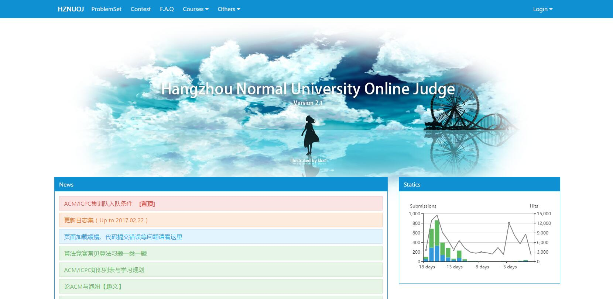
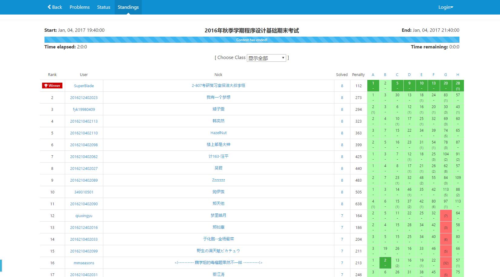
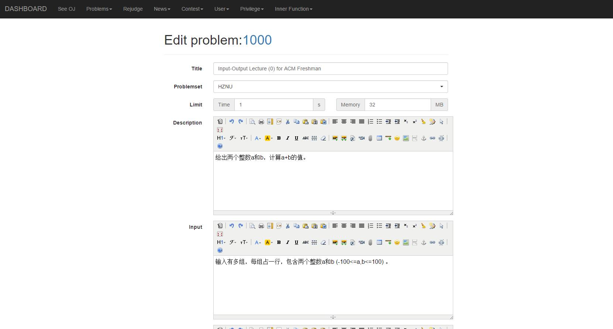
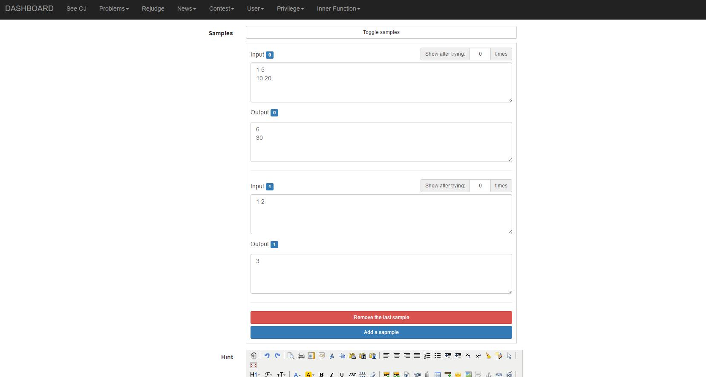
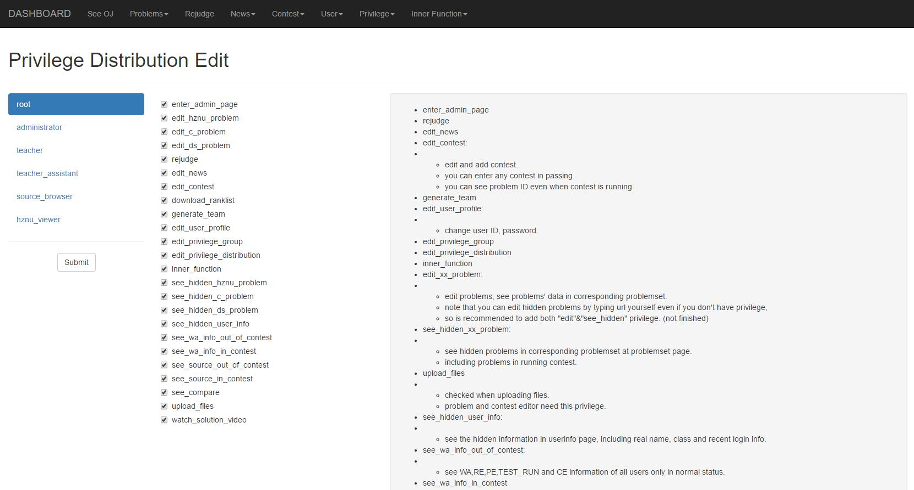

**HZNUOJ 是基于 [HUSTOJ](https://github.com/zhblue/hustoj) 改造而来的，遵循GPL协议开源**

# 优势

* 更华丽的界面
* 更灵活的权限管理
* 支持多组样例

# 界面截图

## 首页

支持提交量和访问量的统计

## 榜单

重写过的的榜单

能点开查看每题的提交状况

## 题目编辑界面

多样例支持

## 权限管理界面

细分的权限分配

# 部署指南

## 使用源码

详情参考[源码部署指南v2.1](wiki/source-deployment-v2.1.md)

另外，HZNUOJ目前只有我一个人在开发，还有许多不足之处。我本身也是ACM队成员，平时训练繁忙，还有许多不友好的功能和小BUG，只能抽时间慢慢改了，所以欢迎大家提交pull request帮忙一起完善HZNUOJ。

# 求赞

最后，如果您觉得HZNUOJ好用，请给我一个Star，这将是对我莫大的帮助与鼓励，十分感谢！
